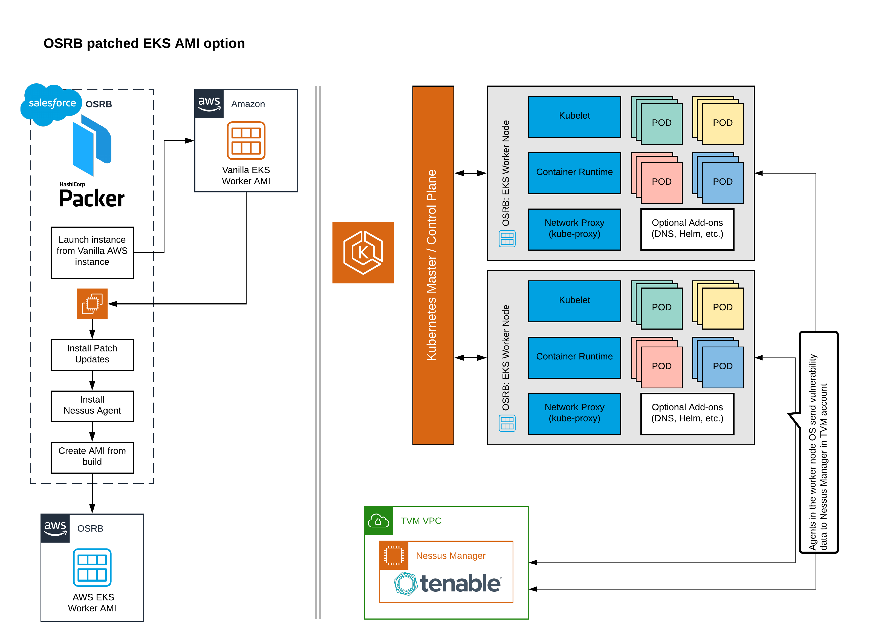
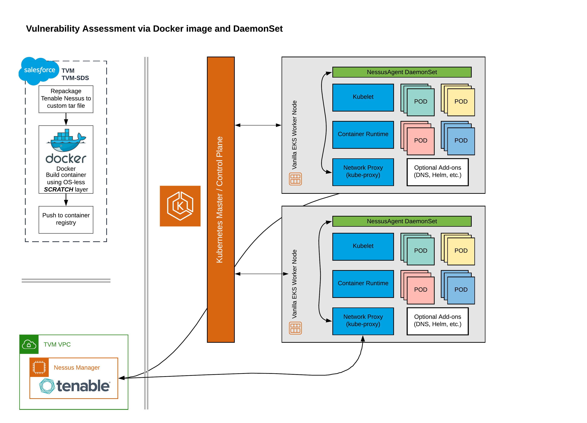
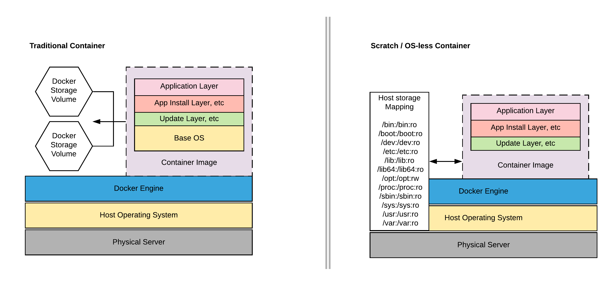

# Nessus Agent and Kubernetes

**Goal**: Determine means to scan underlying Kubernetes compute resources (worker nodes) for patch compliance and vulnerabilities using existing tools.  

* _Short-term goal_: Amazon EKS support
* _Long-term goal_: All possible substrates supported with same tool

## Deployment options

The existing Tenable-supplied tools (NessusAgent) used by Salesforce can be installed on a server if the operating system is supported.  This is the only vendor-supported means of installing the agent.  We also tested vendor un-supported methods of running the agent in a container with intent to deploy the container as a DaemonSet in Kubernetes.


* Install agent in operating system as traditionally done
* Install agent in a Docker container using CentOS-base image and CentOS agent
* Install agent in a Docker container using an OS-less SCRATCH image and the Amazon Linux agent

### Option 1: Successful

Installing agents on an operating system is SOP for TVM.  The process of building an EKS image with the agent installed, linked and scanned was tested by TVM and found to be successful with minor effort involved.

### Option 2: Failure

Installing the NessusAgent in a traditional container was successful; however, it was only able to scan the container OS and filesystem and not the underlying host filesystem even when it was mounted as /host_root or other unique path.  This is a limitation of the agent as it expect to only scan its installed operating system and has no support for a container-based method.  This is ultimately a failure as it doesn’t achieve our goals to scan the host for vulnerabilities.

### Option 3: Success

Building a container using [scratch](https://hub.docker.com/_/scratch), meaning there is no operating-system level, and mapping the underlying host operating system into the container at runtime successfully faked the agent into operating as expected.  While it is still a ‘container’ it is effectively an overlay of the application on the operating system using Docker to execute the processes.  In testing this was successful but there are unknowns as testing was limited.

### NessusAgent limitations

Unless a full Nessus Scanner, the Agent only receives a subset of vulnerability plugins to use and it is based on the agent build (CentOS, Amazon Linux, Ubuntu, SuSE, and so on).  An agent is limited by those plugins to that operating system.  Because of this we would need to build a ‘scratch’ container for each agent version and operating system.  Most cloud providers use Ubuntu for worker nodes; however, Google uses Container-optimized OS that is based on ChromeOS and Tenable does not provide an agent.

## Building the container

Note: You must use the agent that matches the compute/worker node to be scanned.  NessusAgents only download a limited set of plugins based on its intended environment.  If you build a centos-flavor agent and run it on Amazon Linux, it will run but it it will not have any amazon linux plugins to check with.


1. Download agent RPM from https://www.tenable.com/downloads/nessus-agents
2. Unpackage RPM from downloads dir and build filestructure needed for container with everything under /oss_agent `(cd ~/Downloads && mkdir oss_agent && cd oss_agent && rpm2cpio ../NessusAgent-7.4.3-amzn.x86_64.rpm | cpio -idmv)`
3. make bin directory for entrypoint script under /oss_agent `mkdir /Downloads/oss_agent/bin`
4. tar up agent for use in docker build `tar -cvf oss_agent.tar oss_agent/`
5. Move file to location for use in docker build `mv oss_agent.tar $whereever`
6. Build container using `scratch` so no OS layer is included as we will overlay the container using the worker node OS instead
7. ```
FROM scratch
ADD oss_agent.tar /
COPY docker-entrypoint.sh /oss_agent/bin
ENTRYPOINT ["/oss_agent/bin/docker-entrypoint.sh"]
```
8. For the ENTRYPOINT or CMD script, try to symlink agent to the path it would be expected in a normal install.  As this script is triggered at runtime, it shouldn’t overwrite any existing files
9. ```
#!/bin/bash

    echo "-- Symlinking agent"
    ln -sf /oss_agent/opt/nessus_agent /opt/nessus_agent

    echo "-- Symlinking Nessus logs to stdout"
    ln -sf /dev/stdout /opt/nessus_agent/var/nessus/logs/backend.log
    ln -sf /dev/stdout /opt/nessus_agent/var/nessus/logs/nessusd.dump
    ln -sf /dev/stdout /opt/nessus_agent/var/nessus/logs/nessusd.messages

    echo "-- Initializing NessusAgent daemon for database creation"
    timeout 20 /oss_agent/opt/nessus_agent/sbin/nessusd

    echo "-- Linking Nessus Agent"
    /oss_agent/opt/nessus_agent/sbin/nessuscli agent link --name=${SCANNER_NAME} --key=${LINKING_KEY} --groups=${AGENT_GROUPS} --host=${MANAGER_HOST} --port=${MANAGER_PORT}

    echo "-- Starting the NessusAgent"
    /oss_agent/opt/nessus_agent/sbin/nessus-service -q

    exec "$@"
    ```
10. Build the container.  You should have a Dockerfile, entrypoint script, and oss_agent.tar in the build directory.  `docker build -t somerepo/name:version -f Dockerfile .`
11. You need to run the container privileged or with enough capapp for any necessary permissions/mounts.  We want to mount all worker node directories into the container that we can.

12. ```
docker run \
      -v /bin:/bin:ro \
      -v /boot:/boot:ro \
      -v /dev:/dev:ro \
      -v /etc:/etc:ro \
      -v /lib:/lib:ro \
      -v /lib64:/lib64:ro \
      -v /opt:/opt \
      -v /proc:/proc:ro \
      -v /sbin:/sbin:ro \
      -v /sys:/sys:ro \
      -v /usr:/usr:ro \
      -v /var:/var:ro \
      -e LINKING_KEY="REDACTED" \
      -e SCANNER_NAME="agent-$(date -Iminutes)" \
      -e AGENT_GROUPS="docker-test" \
      -e MANAGER_HOST="aws-manager01.sfdcsec.com" \
      -e MANAGER_PORT="8834" \
      -dt darendarrow/nessus-agent:7.4.3-amzn
    ```

## Deploying as a DaemonSet

If we were able to deploy a NessusAgent container to EKS nodes as a DaemonSet we would be able to maintain scanning of these nodes with relative independence of OSRB image builds.  It would also provide a means to support Azure Kubernetes or any other that uses an operating system supported by a Tenable agent.  (Note: this still excludes Google’s Container-optimized OS from being supported)

We have tested the agent in a container with success (option 3).  We have also tested creating a deploying a DaemonSet to an EKS cluster — but not a Falcon environment.

_***Testing in a Falcon environment hasn’t been possible as neither TVM nor TVM-SDS have access to a Falcon account. ***_

Creating a DaemonSet was relatively straightforward:
https://git.soma.salesforce.com/SDS-TVM/nessus_agent_k8s_daemonset/blob/master/nessus_agent_daemonset.yaml

## Architecture overview

* OSRB-build EKS images with Nessus Agent



* Vanilla EKS with containerized NessusAgent



* OS-less container




## Evaluation criteria

|	|NessusAgent in OS Image	|NessusAgent in Container	|
|---	|---	|---	|
|Vendor Supported	|Yes	|No	|
|Immutable	|Yes	|No	|
|Valid Reporting	|Yes	|Yes*	|

The largest criteria for validating this solution was simple “will it work?”  The answer is yes for both OSRB and Container methods.  However, that is keeping the limitations of the agent and OS support in mind.  For “Valid Reporting” we intend that metric to show that the containerized agent provides the same vulnerability data as a vendor-supported install of the agent.  With that in mind, it was successful but our testing was limited to Amazon Linux 2.  Other plugins for other operating systems may have problems.

Deploying the agent as part of the OSRB image wouldn’t invalidate immutable principals as nothing is changed on the OS after deploy.  However, the Docker container must write a single symlink to /opt when being run and that is done after the EKS nodes are deployed and is a violation of immutability.

## Problems

* We can’t mount the host rootfs into a container as a single mount and have the container scan it.  As such, we have to mount the bulk of the host filesystem into the container.  We limited the scope as much as possible but any missing directories may cause false negatives on scans if they are required for certain checks

    *   ```
          -v /bin:/bin:ro \
          -v /boot:/boot:ro \
          -v /dev:/dev:ro \
          -v /etc:/etc:ro \
          -v /lib:/lib:ro \
          -v /lib64:/lib64:ro \
          -v /opt:/opt \
          -v /proc:/proc:ro \
          -v /sbin:/sbin:ro \
          -v /sys:/sys:ro \
          -v /usr:/usr:ro \
          -v /var:/var:ro \
          ```
* We are able to mount most directories as read only with the exception of /opt.  We must symlink /opt/nessus_agent to the custom path in the container else the software can not run.
* We can mount /etc as read only.  This prevents the agent from writing `/etc/tenable_tag` but that does not cause problems.
* There is concerns about mounting /var and exposing other running containers to not only scans but being readable by the Nessus container.  We won’t be scanning other running containers with the agent but if the Nessus container were ever exploited, it would provide read access to every other container on the same worker node.  We can limit by individually mapping subdirectories into the container rather than /var.  But we will need a means of generating this on the fly or routinely checking images to ensure everything is mounted — everything except for /var/lib/docker.
* We use scratch base image in a container (Not a concern, rather a caveat, need to check against SA’s best practices)

### Concerns:

* It is against security assurance best practices to mount important OS level directories into a container: /lib, /lib64, /boot, /dev
* By not mounting everything from OS we might be missing some important scanning paths (need to verify with Tenable)
* Making that many OS level directories mounted in a container creates a large attack vector, hence creating a security risk
* In order to run Nessus network scanner we would need to add network capabilities to a container, more specifically: NET_ADMIN and NET_RAW which will turn some privileged mode capabilities on.

## Ongoing efforts

We believe the level of effort for Tenable to support a containerized agent like we’ve created to be low.  We are pushing for a meeting with Tenable product managers to review what we’ve done, get feedback, and attempt to push them in a direction to where they have an official product offering.  However, this product featureset and timetable would be out of Salesforce hands and we shouldn’t rely on Tenable’s support unless there is a more formal commitment and timetable provided for support.

## Recommendation

I recommend deploying NessusAgent in an OSRB-supplied image for EKS as an interim solution until a better vulnerability scanning solution can be sourced that works across all substrates.  While we have been able to make the NessusAgent function from a Docker container it is not vendor supported and will not support Google Container-optimized OS.

We have managed to limit the risk of running NessusAgent in a container since we no longer need to run as --privileged=true.  But that doesn’t mitigate the risk of the filesystem being mounted into the container.

While we have been able to make the NessusAgent function from a Docker container it is not vendor supported and will not support Google Kubernetes Engine running on container-optimized OS as no agent supports that operating system.

Additionally, if an agent was created for cOS, running in a container is still not supported by the vendor.  We should not rely on unsupported products in the long term for production environments. In AWS, Salesforce is required to manage EKS worker nodes and is responsible for their patches.  As we must maintain the EKS nodes we should continue to use a vendor-supported install method until we have a supported means to deploy on top of Kubernetes.
